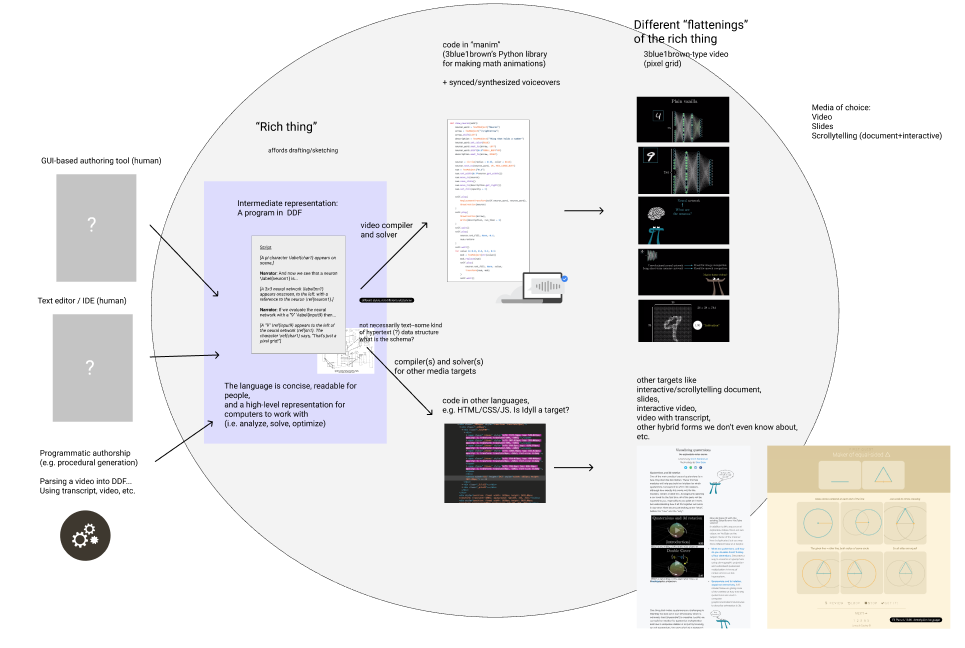

# Finally, A "Swiss Army Knife" For Media Formats

What kinds of media do you consume over the course of a typical day on your computer? You might read a book, watch a movie, listen to a podcast, read the news, or scroll through text posts on a social media platform. That is, you're interacting with digital forms of physical media: a PDF, a mp4, a mp3, and a .txt file are all archival formats for analog media, and a web page is easily printable. 

For a long time, early adopters and programmers have produced content in forms of new media, that is media native to the digital and networked medium, that can't be reproduced in physical form. You can't print the award-winning New York Times article "Snowfall," nor the innovative SB Nation article "17776." Further, hyperlinks, interaction-based acticles, "scrollytelling," and reactive/adaptive educational articles are all examples of content that is rich because it connects and aligns multiple types of media. But the general public has not been easily able to work in new media formats because the tools are missing. 

What if you could describe content in a rich way that preserves the connections, references, and alignments between the subparts of your work? Imagine if you are a lecturer trying to explain complex concepts to a class. Instead of painstakingly making several different materials for your class:

- a printed textbook with static pictures and exercises
- a set of slides with speaker notes
- a video lecture using the slide builds with your voiceover on top, and hand-drawn diagrams on a chalkboard
- a web page explaining the concepts in your class with interactive diagrams you coded yourself

In a sense, all of these different media artifacts you're making are like different shadows on the wall of Plato's cave--of the Platonic object that's in your head. The problem is that the media formats that a computer understands are not rich enough to model the Platonic object that's in your head, so you're forced to "flatten" it in different ways. 

Researchers are working on a media format that lets you describe the "Platonic object"--in analogy to PDF, a portable document format, this is a DDF, a dynamic document format that is both open and portable. Then, researchers are using computational techniques to "magically" generate your media format of choice from that "richer" DDF object.

There would be great impact on media creators and media consumers if this technique succeeds. As a media creator, you can just write one DDF object, and the computer does the hard work of transforming it into the media format you want, automatically syncing your voiceover to slides for a video or aligning content to scrolling on a webpage, for example. And as a media consumer, you can take the DDF object and pick the format that works best for you--say your teacher has sent you a DDF object for their class, and you learn best through marking up a webpage. No problem, you can just use the toolchain to output in a webpage format, and mark it up and remix it yourself. 
