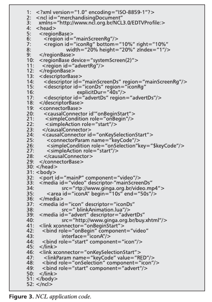

<!-- <link rel="stylesheet" href="https://acdlite.github.io/jquery.sidenotes/css/main.css"> -->

<!-- https://tscanlin.github.io/tocbot/ -->
<!-- <link rel="stylesheet" href="https://tscanlin.github.io/tocbot/static/css/styles.css" class="next-head"> -->

<link rel="stylesheet" href="https://cdnjs.cloudflare.com/ajax/libs/tocbot/4.4.2/tocbot.css">

<link rel="stylesheet" href="lib/styles.css" class=next-head>

<link rel="stylesheet" href="styles/toolkit-styles.css" class="next-head">

<nav class="toc toc-right js-toc relative z-1 transition--300 absolute pa4 is-position-fixed">
</nav>

<!--  -->
<!--  -->
<!-- <link rel="stylesheet" href="lib/annotator-full.1.2.10/annotator.min.css"> -->
  
# Fluid Media Format

## Research questions

The key research challenges are:

- Is it actually possible to design an IR that compiles to many different media formats?
- How do we design an IR that’s both readable/authorable to end-users and supports common machine analyses on creating dynamic media?
- How do we fit existing handmade dynamic artifacts into this framework?

Other questions include:

- What are the design goals?
- What are the other research challenges?
- What are the output media formats?
- What existing examples can we to reproduce?
- How to augment existing examples?
    - Existing examples of augmenting existing examples?
- Example breakdowns of existing examples into language?
- Example recreations/augmentations/remixes of existing examples via the compiler?
- Communities and people to interview?
- How do existing languages / approaches work?
    - Authoring tools: What are existing ways of composing aligned & referenced media?
- Why is this work particularly timely?
- How do we systematically study/code the forms of reference, alignment, juxtaposition between different forms of media?

## Related work

This section summarizes the three most relevant pieces of related work for what a language for rich media might have to provide. 

### Format

- Sources
- Name
- Creators
- Dates active
- Purpose
- Language features
- Input
- Output
- Limitations

### Ginga + Nested Context Language (NCL)

Ginga is a middleware language and open specification developed originally for interactive and multimedia IPTV applications by the Telemidia Lab in Brazil from about 2005-2010. It is now the standard for terrestrial digital TV in most of Latin America. It relies on a language called the Nested Context Language, or NCL. As the Ginga-NCL paper summarizes it:

> Nested Context Language, [is] a domain-specific declarative language targeting multimedia application authoring. As a glue language, NCL relates media objects in time and space without restricting or imposing any media content type, including media objects with imperative and declarative code written using other languages. Other NCL features include support for multidevice presentations, content adaptations, presentation adaptations, and advanced code reuse. Ginga-NCL allows NCL applications to be modified on the fly by means of live editing commands.

NCL also looks quite a bit like XML, and seems very related to SMIL (below). It also integrates with Lua, another programming language popular in Brazil.

From the NCL Club site, it seems like NCL has graphical authoring environments that can support artifacts such as game development, though it's hard for me to figure out its capacities since most of the documentation is written in Portuguese.

Sources: 

- [Ginga on Wikipedia](https://en.wikipedia.org/wiki/Ginga_(middleware))
- [Ginga official page](http://www.ginga.org.br/en)
- [Ginga-NCL](http://www.iginga.org/files/biblio/2010_06_soares.pdf) (Soares et al, 2010)
- [Awesome NCL projects on GitHub](https://github.com/TeleMidia/awesome-ncl)
- [NCL Page tutorials](http://www.ncl.org.br/en/tutorials0)
	- [Club NCL](http://club.ncl.org.br/node/31)
	- [WebNCL](https://dl.acm.org/doi/10.1145/2382636.2382719)
	- [NCL Composer](http://composer.telemidia.puc-rio.br/doku.php/en/start?redirect=1)

### Synchronized Multimedia Integration Language (SMIL)

The Synchronized Media Integration Language (SMIL) is an XML-based language for describing multimedia presentations. It seems to be have created in 1998 and died out in the mid-2000s. SMIL includes inline HTML tags for embedding different kinds of media content, specifying a region of placement, the timing, the linking between elements, and adaptivity for languages.

The upside of SMIL is that it can work with any semantic web element, including SVG. That's exciting because then animation and timing can be deeply linked to the visuals of a document. Another interesting part of SMIL is how its language design allows users to specify parallel or sequential presentation of content.

From 2000-2010, there were a couple of efforts to extend semantic web standard with an element of time, including projects like the Timed Text Markup Language (TTML), SMIL + Time, (X)HTML + TIME, SMIL State, and timesheets.js. They all seem to have died out. 

The SMIL State paper gives a great summary of SMIL in Section 3.3:

> SMIL 2.1, the Synchronous Multimedia Integration Language [3, 4] is the W3C standard for presenting multimedia on the web. It is primarily an integration language: it contains references to media items, not the media data itself, and instructions on how those media items should be combined spatially and temporally. 

> SMIL is a declarative language: relations between media objects (and substructures) are described, and the computation of the timeline follows from this. The main temporal composition operators available are parallel composition, sequential composition and selection of optional content. Composition is hierarchical: nodes cannot become active unless all of their ancestors are active. The declarative containment model has one large advantage: SMIL presentations can adapt automatically to varying bandwidth conditions and alternate content with different durations. The hierarchical temporal composition model is also a nice container for timed metadata, and allows structure-based deep linking into the content. 

> There are a number of mechanisms in SMIL that allow the presentation to react to user input (events) and to modify the behavior of other sections of the presentation (SMIL Animation) but none of these break the basic containment model, they only modify behavior within those constraints. 

> The containment model has one serious drawback, though: there is no way in which the path taken through the presentation can be used to influence future behavior of the presentation. Or, more informally: there are no variables. In addition, with events being the only communication channel a SMIL presentation can not exchange structured data with the outside world. This is a problem SMIL shares with many declarative languages. For example, functional languages have had to add constructs like effect classes [6] or monads [12, 18] to enable side-effects and input/output. Without these, their application domain would have been severely limited. 

Sources:

- [SMIL Wikipedia](https://en.wikipedia.org/wiki/Synchronized_Multimedia_Integration_Language)
- SMIL authoring systems
- Related standards: XHTML + SMIL, HTML + TIME
- [TTML](https://en.wikipedia.org/wiki/Timed_Text_Markup_Language)
- [SMIL State](https://homepages.cwi.nl/~jack/presentations/smilstate-for-rwab.pdf)
- [Retro SMIL tutorial](https://homepages.cwi.nl/~media/SMIL/Tutorial/SMILTut.html)
- [timesheets.js](http://wam.inrialpes.fr/timesheets/)
    - [other reference](https://ics.utc.fr/c2m/res/TimesheetsSoftware.pdf)

### VideoPuppet 

Their slogan is "edit video as easily as editing text!"

Sources:

- [Main page](https://www.videopuppet.com/)
- [Show HN: From Markdown to Video](https://news.ycombinator.com/item?id=22718854)

#### Misc.

- Idyll (language for creating interactive web documents)
- manim (3blue1brown's library)
- [YouTube Timed Text editor](https://www.youtube.com/timedtext_editor?action_mde_edit_form=1&v=Kas0tIxDvrg&lang=en&bl=vmp&ui=hd&ref=player&tab=captions&ar=1585953093029&o=U)
- ["Video Digests"](http://vis.berkeley.edu/papers/videodigests/videodigests_small.pdf) (Pavel, Agrawala, et al.)

## Examples

General examples of multimodal alignment:

- Text/Image/Sound: math explainer videos / slides
- Text/Sound: music videos / karaoke videos / podcasts
- Text/Image: reactive articles (e.g. incremental visualization)
- Text/Text: subtitles / translation
- Text/Interaction: scrollytelling

Input formats:

- Plain text
- GUI
- Algorithmically generating (i.e. parsing)

Output formats: 

- Video with voiceover
- Print book
- Podcast
- Scrolling/interactive webpage
- (Web) Slides with builds and speaker notes

Pain points:

- Synchronization, alignment, and reference matter, and are hard tasks that can benefit from automation, and free up iteration time. 

(From VideoPuppet site)

> In 2016, two friends and I released an opensource tool and wanted to make some nice demos and tutorial videos. When creating videos, I ended up spending most of the time doing things that have nothing to do with the content, but with the boring tasks around synchronisation and alignment.

(Quote from faculty member in CS)

> "I find myself converting my written text into slides and then into video, but I'm always pointing at stuff (like a subpart of a diagram) in my slides and can't reference it in speech, so then I have to make these very granular builds for the slides, but then I have trouble syncing up what I'm saying to the builds"

Examples of artifacts:

- [Jonathan Corum example](http://style.org/tapestry/)
- [Ways of Hearing](https://mitpress.mit.edu/books/ways-hearing): podcast to book

## Research thoughts

Katherine:

> My intuition is that a main research contribution of our work is to systematically study the forms of reference and alignment between different forms of existing multimodal media, produce knowledge about how authors are doing that or want to do that, and propose a high-level language-based way of specifying that in a DDF. 

Max:

> Something I want to grapple with personally for this project is the relative importance of encoding existing material into empirically determined primitives vs Reigniting student agency by deconstructing the content that was "flattened" in the first place. The representation in the lecturer's brain will always be richer than the student's, and the best tools reify these representations to play with live.

> just thinking out loud some more: I want to steer the tool away from reinforcing the status quo on the student end. Students already are given lectures, videos, slides, and sparse explorables, if the DDF is just a compiler then all it helps are teachers (analogy: end users don't care about clang vs gcc).If the mappings aren't erased after compilation, and students benefit from the richer DDF representation, then we have a medium that's better than existing ones.

> 3b1b videos are awesome, literate tutorials are awesome, and maybe the state of education would be better if we had '''more''' of them, but I do want to explore the richer axis we were brainstorming where the content is less flat

> richer media: I'm not 100% sure what is "better" or "more effective" but I do like the aligned content with a rich underlying data structure like the ones we've been collecting

> but really any video, slides, etc which is more hypertext-like: where there's an underlying set of data that renders it and lets you query and interrogate the data semantically through the host medium of video/slides/etc

> like clicking "x" at 5:34 of some khan video and seeing where it appears and maybe a history of its manipulations

> and further (which doesn't really exist anywhere), a bricolage "script" environment where you can see the flattened content in context with all the broader ideas they were pulled from (?)

Katherine:

> Yeah, I like all these ideas, and I do think the idea of compilation makes these new media possible. I think in a paper, it would be great to demo 1-2 of these formats to show the claim that the richer/structure-preserving representation enables new capabilities without much additional work.

> We can repro all these existing diagrams... with these magic features that are enabled by a good design

> Note that the magic part is more than just a cherry on top of the Penrose paper, it's part of why it's so fundamentally compelling/exciting, and we go to great lengths to show what the system can do that Illustrator can't

<!--  -->

