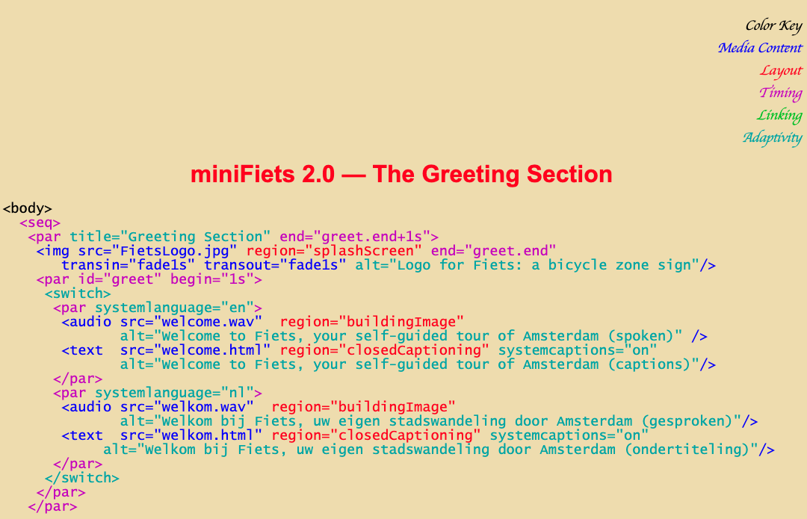

<!--  -->
<!--  -->
<!-- <link rel="stylesheet" href="lib/annotator-full.1.2.10/annotator.min.css"> -->
  
# Fluid Media Format

## Research questions

The key research challenges are:

- Is it actually possible to design an IR that compiles to many different media formats?
- How do we design an IR that’s both readable/authorable to end-users and supports common machine analyses on creating dynamic media?
- How do we fit existing handmade dynamic artifacts into this framework?

Other questions include:

- What are the design goals?
- What are the other research challenges?
- What are the output media formats?
- What existing examples can we to reproduce?
- How to augment existing examples?
    - Existing examples of augmenting existing examples?
- Example breakdowns of existing examples into language?
- Example recreations/augmentations/remixes of existing examples via the compiler?
- Communities and people to interview?
- How do existing languages / approaches work?
    - Authoring tools: What are existing ways of composing aligned & referenced media?
- Why is this work particularly timely?
- How do we systematically study/code the forms of reference, alignment, juxtaposition between different forms of media?

## Related work

### Format

- Sources
- Name
- Creators
- Dates active
- Purpose
- Language features
- Input
- Output
- Limitations

### Ginga / NCL (date?)

Ginga is...

Sources: 

- [Ginga-NCL](http://www.iginga.org/files/biblio/2010_06_soares.pdf)
- [NCL Page tutorials](http://www.ncl.org.br/en/tutorials0
	- [Club NCL](http://club.ncl.org.br/node/31)
	- [WebNCL](https://dl.acm.org/doi/10.1145/2382636.2382719)
	- [NCL Composer](http://composer.telemidia.puc-rio.br/doku.php/en/start?redirect=1)

### SMIL, XHTML + SMIL, HTML + TIME

SMIL is...

Synchronized Media Integration Language
XML-based language for describing multimedia presentations
Seems to be dead since mid-2000s

Sources:

- SMIL authoring systems
- [TTML](https://en.wikipedia.org/wiki/Timed_Text_Markup_Language)
- [SMIL + Time](https://homepages.cwi.nl/~jack/presentations/smilstate-for-rwab.pdf)
- [Retro SMIL tutorial](https://homepages.cwi.nl/~media/SMIL/Tutorial/SMILTut.html)
- [timesheets.js](http://wam.inrialpes.fr/timesheets/)
    - [other reference](https://ics.utc.fr/c2m/res/TimesheetsSoftware.pdf)

### VideoPuppet 

Their slogan is "edit video as easily as editing text!"

Sources:

- [Main page](https://www.videopuppet.com/)
- [Show HN: From Markdown to Video](https://news.ycombinator.com/item?id=22718854)

#### Misc.

- Idyll (language for creating interactive web documents)
- manim (3blue1brown's library)
- [YouTube Timed Text editor](https://www.youtube.com/timedtext_editor?action_mde_edit_form=1&v=Kas0tIxDvrg&lang=en&bl=vmp&ui=hd&ref=player&tab=captions&ar=1585953093029&o=U)
- ["Video Digests"](http://vis.berkeley.edu/papers/videodigests/videodigests_small.pdf) (Pavel, Agrawala, et al.)

## Examples

General examples of multimodal alignment:

- Text/Image/Sound: math explainer videos / slides
- Text/Sound: music videos / karaoke videos / podcasts
- Text/Image: reactive articles (e.g. incremental visualization)
- Text/Text: subtitles / translation
- Text/Interaction: scrollytelling

Input formats:

- Plain text
- GUI
- Algorithmically generating (i.e. parsing)

Output formats: 

- Video with voiceover
- Print book
- Podcast
- Scrolling/interactive webpage
- (Web) Slides with builds and speaker notes

Pain points:

- Synchronization, alignment, and reference matter, and are hard tasks that can benefit from automation, and free up iteration time. 

> In 2016, two friends and I released an opensource tool and wanted to make some nice demos and tutorial videos. When creating videos, I ended up spending most of the time doing things that have nothing to do with the content, but with the boring tasks around synchronisation and alignment.

(VideoPuppet)

> "I find myself converting my written text into slides and then into video, but I'm always pointing at stuff (like a subpart of a diagram) in my slides and can't reference it in speech, so then I have to make these very granular builds for the slides, but then I have trouble syncing up what I'm saying to the builds"

(Faculty member in CS)

Examples of artifacts:

- [Jonathan Corum example](http://style.org/tapestry/)
- [Ways of Hearing](https://mitpress.mit.edu/books/ways-hearing): podcast to book

## Research thoughts

Katherine:

> My intuition is that a main research contribution of our work is to systematically study the forms of reference and alignment between different forms of existing multimodal media, produce knowledge about how authors are doing that or want to do that, and propose a high-level language-based way of specifying that in a DDF. 

Max:

> Something I want to grapple with personally for this project is the relative importance of encoding existing material into empirically determined primitives vs Reigniting student agency by deconstructing the content that was "flattened" in the first place. The representation in the lecturer's brain will always be richer than the student's, and the best tools reify these representations to play with live.

> just thinking out loud some more: I want to steer the tool away from reinforcing the status quo on the student end. Students already are given lectures, videos, slides, and sparse explorables, if the DDF is just a compiler then all it helps are teachers (analogy: end users don't care about clang vs gcc).If the mappings aren't erased after compilation, and students benefit from the richer DDF representation, then we have a medium that's better than existing ones.

> 3b1b videos are awesome, literate tutorials are awesome, and maybe the state of education would be better if we had '''more''' of them, but I do want to explore the richer axis we were brainstorming where the content is less flat

> richer media: I'm not 100% sure what is "better" or "more effective" but I do like the aligned content with a rich underlying data structure like the ones we've been collecting

> but really any video, slides, etc which is more hypertext-like: where there's an underlying set of data that renders it and lets you query and interrogate the data semantically through the host medium of video/slides/etc

> like clicking "x" at 5:34 of some khan video and seeing where it appears and maybe a history of its manipulations

> and further (which doesn't really exist anywhere), a bricolage "script" environment where you can see the flattened content in context with all the broader ideas they were pulled from (?)

Katherine:

> Yeah, I like all these ideas, and I do think the idea of compilation makes these new media possible. I think in a paper, it would be great to demo 1-2 of these formats to show the claim that the richer/structure-preserving representation enables new capabilities without much additional work.

> We can repro all these existing diagrams... with these magic features that are enabled by a good design

> Note that the magic part is more than just a cherry on top of the Penrose paper, it's part of why it's so fundamentally compelling/exciting, and we go to great lengths to show what the system can do that Illustrator can't

<!--  -->
